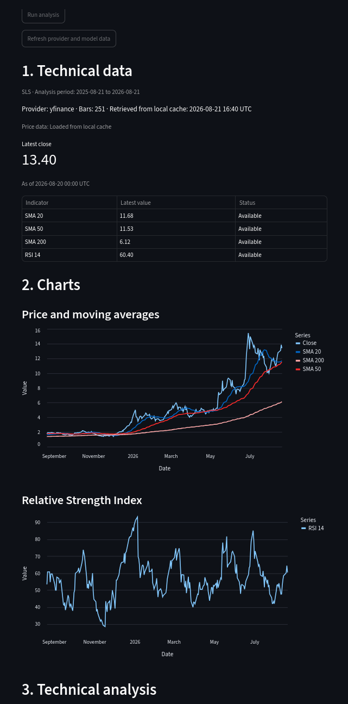

# OptionAI

OptionAI is an AI-assisted options decision-support platform. It combines
deterministic market calculations with structured language-model analysis to
help a user evaluate an options strategy transparently.

OptionAI is a decision-support system, not an autonomous trading system. It
does not place orders or execute trades.

## Why this project exists

The project has three connected goals.

1. **Build something useful.** OptionAI is based on my personal experiences as
   an investor and trader. It formalizes a decision-making process I have
   learned through trial and error, with the goal of helping me avoid poor
   decisions and make risks more visible.
2. **Apply my Data Science studies.** The project lets me turn learning from
   my Master's studies—particularly AI/ML, data processing, and software
   development practices—into a working system.
3. **Learn modern AI engineering.** I use the project to develop practical
   skills in LLM engineering, agent workflows, API design, distributed
   services, cloud deployment, and AI-assisted software development.

## Main capabilities

- Technical analysis using validated market data and indicators.
- Market-context and company-news analysis.
- Options-chain and volatility analysis.
- User selection between `anticipatory_put` and `recovery_call` strategies.
- Structured report classification as supporting, conflicting, or neutral.
- Deterministic recommendations: `proceed`, `reconsider`, or `wait`.
- Transparent evidence, risks, limitations, and invalidation conditions.
- Human-in-the-loop progressive analysis: initial reports first, options and
  recommendation analysis after strategy selection.
- Configurable direct, FastMCP, and raw MCP technical-data providers.
- Cached results with visible freshness, cache-hit, and refresh status.

## Application preview

The screenshot below shows the Streamlit Technical data.



## Architecture

```text
Streamlit UI
     ↓
FastAPI application boundary
     ↓
StateGraph workflow
     ↓
Domain agents, tools, services, schemas, and prompts
     ↓
Market/news/options providers and configurable MCP data provider
```

The application separates responsibilities deliberately:

- deterministic Python code calculates indicators, options metrics, and the
  final recommendation outcome;
- agents use LLMs for interpretation, classification, summarization, and
  explanation;
- Pydantic schemas validate data at service and API boundaries;
- the StateGraph controls sequencing, continuation, parallel analysis, and
  error handling;
- MCP is an optional provider interface, not a replacement for the workflow.

The Docker deployment uses independent API, Streamlit, and MCP services. The
local Python workflow and Docker Compose workflow remain available alongside the
cloud deployment target.

## Engineering highlights

- Automated testing, type checking, linting, coverage, and security checks.
- Schema-first domain and API design.
- Deterministic business rules separated from LLM reasoning.
- Domain-agent implementations and a model factory demonstrating provider
  selection, schema-guided responses, caching, and error handling.
- Synchronous and asynchronous StateGraph execution.
- Parallel Market Context and Ticker News analysis.
- FastAPI request validation and progressive continuation endpoints.
- FastMCP and raw MCP implementations with aligned tool schemas.
- Layered caches for provider data, LLM reports, options data, and raw data,
  with explicit TTL and refresh policies.
- LLM telemetry for provider, model, token usage, cache status, and request
  duration.
- Docker Compose service boundaries, health checks, named cache volumes, and
  specialized runtime images.
- Cloud-oriented configuration for Cloud Run, Artifact Registry, Secret
  Manager, and Cloud Storage.

## Technology stack

### Languages and data tools

- Python
- Bash and YAML
- pandas and NumPy
- yfinance
- pandas-ta-classic

### AI and backend

- LangChain
- LangGraph / StateGraph
- Google Gemini and OpenAI-compatible model integrations
- Versioned domain-specific prompt templates
- Schema-guided structured LLM outputs
- Prompt, input, and output separation
- FastAPI
- Pydantic
- Model Context Protocol (MCP) and FastMCP

### User interface and deployment

- Streamlit
- Docker and Docker Compose
- GitHub Actions
- Google Cloud Run
- Google Artifact Registry
- Google Cloud Storage
- Google Secret Manager
- `gcloud` CLI

### Testing and quality

- pytest and pytest-cov
- GitHub Actions coverage reporting
- Ruff
- MyPy
- Bandit
- Gitleaks
- pre-commit quality gates
- Grype container image scanning
- Dependabot

### Configuration

Configuration is centralized in `app/config/config.py`. Settings are loaded
from environment variables with the `OPTIONAI_` prefix, while local secrets
are kept outside the repository. This keeps local, Docker Compose, and cloud
deployment configuration separate from application logic.

## AI-assisted development

The project was developed with OpenAI Codex assistance. I personally defined
the architecture, implementation plan, deterministic business rules, testing
strategy, documentation, and acceptance criteria, and reviewed and validated
all generated changes.

Codex was guided by repository-level instructions, architecture documents,
ADRs, a product backlog, an implementation log, and a learning journal. The
generated code was checked with automated tests, type checking, linting,
security checks, and live verification. This project therefore also serves as
an experiment in disciplined AI-assisted software development rather than
unreviewed code generation.

## Local development

The public portfolio edition is a curated technical showcase and is not
intended to run as a complete standalone product. The commands below describe
the corresponding workflow in the full private implementation.

Development is performed in a Conda environment. Math- and compute-heavy
packages are installed and managed with Conda, while the remaining
application and development dependencies are installed with `uv pip`. The
exact environment setup is intentionally kept separate from the runtime
containers: tools such as pytest, MyPy, coverage, and pre-commit are not
required in the minimal service images.

Create the project environment and provide the required LLM credentials through
environment variables or a local secrets file. Then run the Streamlit UI from
the project root:


```bash
streamlit run streamlit_app.py
```

For a complete local multi-service workflow:

```bash
python scripts/run_local.py
```

The technical-data provider can be selected with
`OPTIONAI_TECHNICAL_DATA_PROVIDER=direct`, `mcp`, or `raw_mcp`.

## Docker Compose

The containerized workflow runs the API, Streamlit, and MCP services together:

```bash
docker compose --env-file ~/.secrets/.env up --build
```

Open the Streamlit UI at `http://localhost:8501`. The API and MCP services use
internal Compose service names, health checks, and persistent named volumes.

## Testing

The project uses offline tests for deterministic and API behavior. Provider and
LLM boundaries are replaced with mocks or fakes in automated tests, so tests do
not make live market-data or model calls. This keeps the suite deterministic,
fast, and inexpensive while still exercising validation, routing, caching, and
error handling. A typical local verification sequence is:

```bash
ruff check
ruff format --check
mypy .
pytest
bandit -r app
pytest --cov=app --cov-report=term-missing
```

Live provider and LLM evaluations are performed separately for selected manual
reviews and are never part of the automated test suite.

The tests included in this portfolio are representative and sanitized. They
demonstrate validation, caching, health checks, and graph behavior without
publishing the production strategy rules, recommendation thresholds, or
detailed API contract.

## CI/CD direction

The planned cloud workflow is:

```text
Local development:
  edit → run tests → optionally build/run Docker Compose

Pull request:
  push branch → GitHub runs tests, builds images, scans images, and reports results

Main/release:
  release tag → GitHub builds and scans images → pushes to Artifact Registry → deploys Cloud Run
```

Images built on GitHub-hosted runners are temporary unless a release workflow
publishes them. Grype scans images before cloud authentication and publication.

## Project status and scope

The local MVP, asynchronous workflow, FastAPI boundary, MCP provider paths,
Docker Compose deployment, and specialized service images are implemented. The
cloud phase targets low-cost Cloud Run deployment with managed secrets and
persistent storage while preserving the same application core.

This public repository is a curated portfolio edition. Some private learning
notes, personal investment documentation, prompts, and strategy-specific
materials may be intentionally omitted. The prompt modules included here are
sanitized templates that demonstrate prompt architecture and schema-guided LLM
integration; production prompt wording and strategy-specific instructions are
not published. Technical Analysis, Market Context, and Ticker News agents are
included as representative implementations. The Options Analysis and
Recommendation agents are intentionally omitted because they contain more
strategy-specific production logic. The technical schemas and tools are also
sanitized examples: they show validated deterministic data flow and the
separation between plotting data and compact LLM facts without publishing the
production indicator contract.

## License

Copyright © 2026. All rights reserved.

This repository is published for portfolio and evaluation purposes. No
permission is granted to copy, modify, redistribute, or use the code
commercially without written permission.
