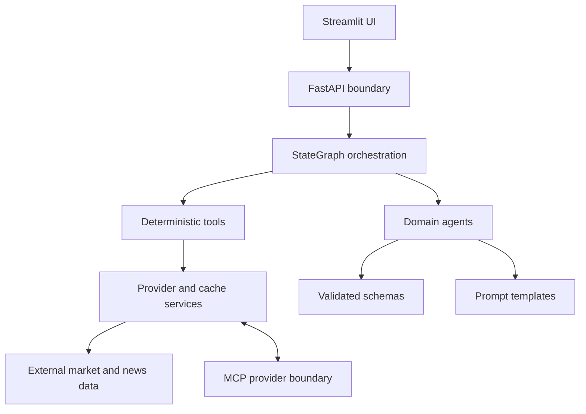
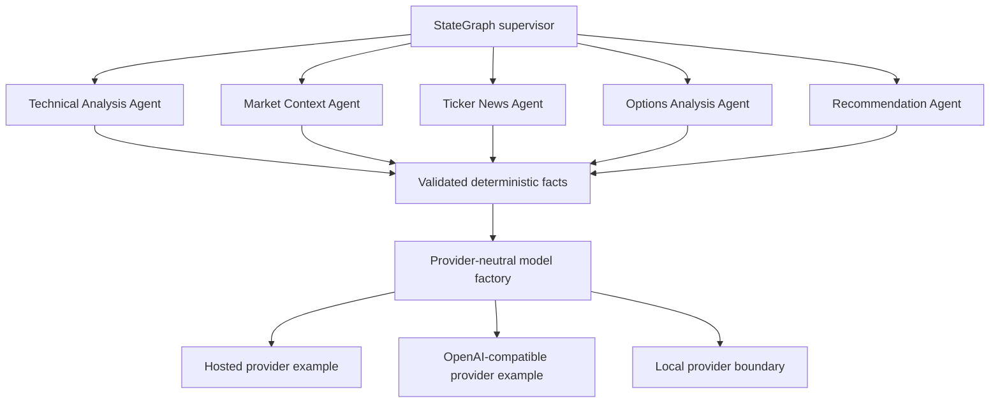

# OptionAI architecture — portfolio overview

This is a curated high-level view. Production schemas, prompts, strategy rules,
and detailed implementation relationships remain in the private repository.

## Layered architecture



## Responsibilities

- **UI** presents reports, metadata, warnings, and human-in-the-loop controls.
- **FastAPI** validates requests and provides the application boundary.
- **StateGraph** controls workflow sequencing, continuation, parallel branches,
  and failure handling.
- **Agents** interpret validated facts and return structured LLM output.
- **Tools** perform deterministic calculations and provider orchestration.
- **Services** isolate external providers and cache/storage behavior.
- **Schemas** define validated data contracts at boundaries.
- **Prompts** provide versioned, domain-specific instructions for model calls.
- **MCP** is an optional external provider interface with a narrow tool schema.

## Deterministic and LLM responsibilities

Python owns numerical calculations, validation, cache policy, workflow routing,
and the final deterministic decision. LLMs are used for interpretation,
classification, summarization, and explanation. Models do not retrieve data or
override deterministic outcomes.

## Deployment boundary

The local and cloud service shape is:

```text
Streamlit → FastAPI → StateGraph and services
                         ↓
                    optional MCP provider
```

Docker Compose and the planned Cloud Run deployment use separate API,
Streamlit, and MCP service images. The public UI is the only public-facing
service in the target cloud design.

## Multi-agent and provider boundary



The public examples intentionally show boundaries rather than complete
production prompts, schemas, or strategy rules. Deterministic code owns
calculations, validation, routing, and outcome rules; LLM providers interpret
validated facts and explain them.

### Static per-agent model configuration

Each agent can select its provider and model through configuration. An
agent-specific setting overrides the global default; otherwise the global
provider and model are used. This is deliberate configuration, not dynamic
runtime routing. It supports experiments such as using Gemini for most agents
and OpenAI for Recommendation while keeping the workflow deterministic.

The initial local comparison has already tested Ollama with both a general
Gemma model and a finance-tuned GGUF model. The cloud deployment deliberately
uses Google models for every agent rather than a mixed provider configuration,
because OpenAI requests are billable under the current project cost policy.
Ollama is available for local experiments through a separate local API image.
Future evaluation can compare additional Ollama-imported Hugging Face GGUF
models or direct llama.cpp adapters through the same boundary.

## Cloud authentication and persistence

GitHub Actions uses Workload Identity Federation rather than a long-lived
service-account key. Cloud Run services use separate runtime identities and are
private by default. Personal Streamlit access uses an authenticated local proxy;
Streamlit → API and API → MCP calls use audience-specific identity tokens and
`roles/run.invoker` bindings. A future Identity-Aware Proxy could provide
Google-account login without changing the application.

Local and Compose deployments use filesystem or Docker-volume persistence. The
cloud design uses Cloud Storage for durable objects under separate provider,
LLM-cache, and raw-data prefixes. Cloud Run's local filesystem is disposable.
Exact bucket, project, and account values are intentionally omitted here.

## Engineering qualities

- schema-first validation;
- provider-neutral services;
- synchronous reference and asynchronous workflow paths;
- explicit cache and runtime metadata;
- testable deterministic business rules;
- replaceable local and cloud storage adapters.
