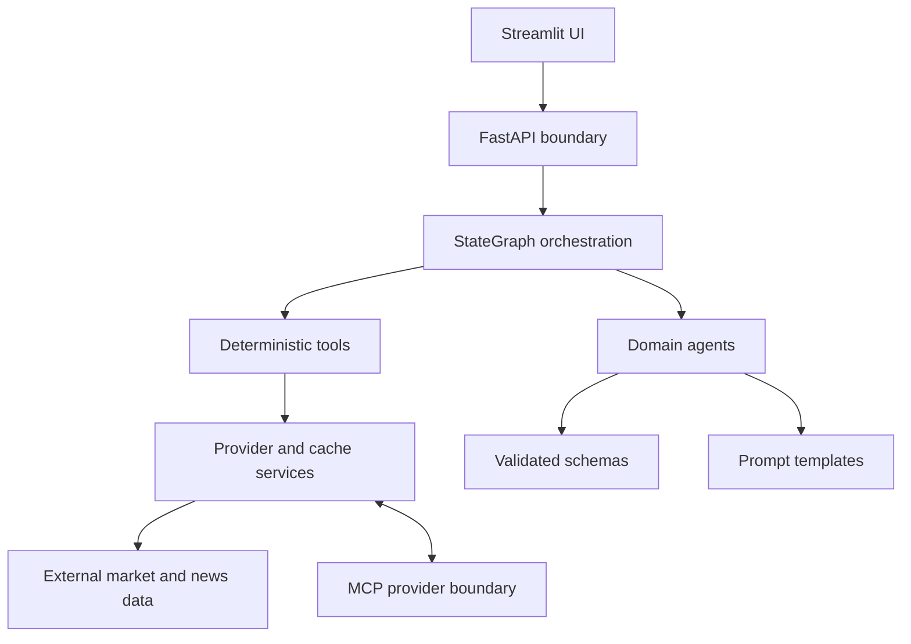

# OptionAI architecture — portfolio overview

This is a curated high-level view. Production schemas, prompts, strategy rules,
and detailed implementation relationships remain in the private repository.

## Layered architecture



## Responsibilities

- **UI** presents reports, metadata, warnings, and human-in-the-loop controls.
- **FastAPI** validates requests and provides the application boundary.
- **StateGraph** controls workflow sequencing, continuation, parallel branches,
  and failure handling.
- **Agents** interpret validated facts and return structured LLM output.
- **Tools** perform deterministic calculations and provider orchestration.
- **Services** isolate external providers and cache/storage behavior.
- **Schemas** define validated data contracts at boundaries.
- **Prompts** provide versioned, domain-specific instructions for model calls.
- **MCP** is an optional external provider interface with a narrow tool schema.

## Deterministic and LLM responsibilities

Python owns numerical calculations, validation, cache policy, workflow routing,
and the final deterministic decision. LLMs are used for interpretation,
classification, summarization, and explanation. Models do not retrieve data or
override deterministic outcomes.

## Deployment boundary

The local and cloud service shape is:

```text
Streamlit → FastAPI → StateGraph and services
                         ↓
                    optional MCP provider
```

Docker Compose and the planned Cloud Run deployment use separate API,
Streamlit, and MCP service images. The public UI is the only public-facing
service in the target cloud design.

## Engineering qualities

- schema-first validation;
- provider-neutral services;
- synchronous reference and asynchronous workflow paths;
- explicit cache and runtime metadata;
- testable deterministic business rules;
- replaceable local and cloud storage adapters.
