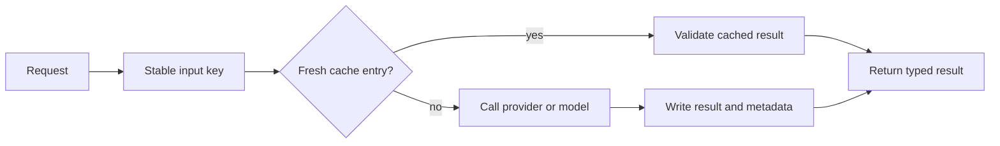

# Cache flow — portfolio overview

The application uses caches to reduce provider calls, LLM cost, and response
latency. Cache entries are validated before use and expose hit/miss metadata to
the UI.

Separate cache areas are used for provider data, LLM reports, options data, and
raw data. Local development uses filesystem directories; Docker Compose uses
named volumes; the cloud phase provides a managed storage adapter.

The public implementation intentionally omits production cache-key fields,
exact TTL values, and recommendation-cache details.
