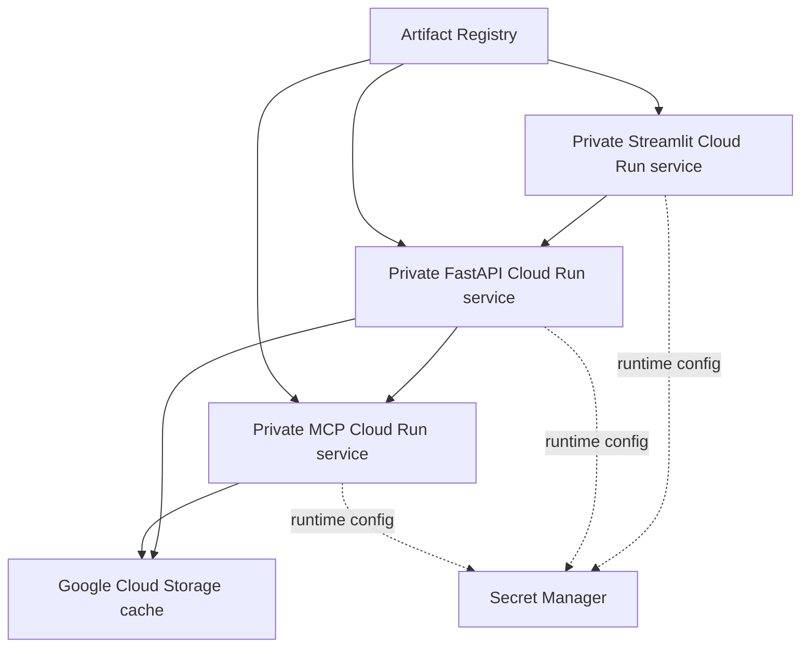

# Phase 5: low-cost GCP deployment

## Purpose

Phase 5 documents how the Dockerized OptionAI services were prepared for
Google Cloud. This portfolio edition presents the sanitized architecture and
engineering evidence; the complete deployment workflow remains private.

## Goals and constraints

- Keep cloud costs minimal.
- Build images in GitHub Actions and push them to Google Artifact Registry.
- Scan images with pinned Grype tooling before publishing them.
- Manage GCP resources with the `gcloud` CLI.
- Keep Docker Compose and the non-Docker local workflow working.
- Never commit API keys or long-lived cloud credentials.
- Keep the public surface limited to the Streamlit UI.

## Target architecture



Cloud Run services are private by default. FastAPI and MCP use authenticated,
private service-to-service access, while personal browser access to Streamlit
uses an authenticated local Cloud Run proxy. Cloud Storage replaces persistent local
cache files for cloud deployments; local files remain the default for
development.

## Implementation sequence

### 1. Cloud-readiness audit

Inventory environment variables, service URLs, filesystem writes, cache
directories, health checks, image entry points, and local-only assumptions.

Audit result:

- `Settings` already centralizes API/MCP URLs, bind hosts, ports, provider mode,
  LLM settings, and secrets through `OPTIONAI_` environment variables.
- Docker Compose overrides bind hosts and service-name URLs for container
  networking; local defaults remain suitable for the non-Docker launcher.
- API and MCP write filesystem caches under `data/cache`, `data/llm_cache`, and
  `data/raw`. These paths are persistent only through Compose volumes and need
  a Cloud Storage adapter for Cloud Run.
- API and MCP expose health/readiness endpoints suitable for Cloud Run probes.
- The three specialized images already have independent entry points and can
  be deployed separately.
- No cloud-specific storage adapter, Artifact Registry workflow, Workload
  Identity configuration, or Cloud Run deployment definitions exist yet.

The audit is complete. The first implementation gap is the configurable storage
boundary; GCP resource design can proceed in parallel as documentation and CLI
setup.

### 2. GCP resource design

Select one region and define the project, Artifact Registry repository, Cloud
Storage bucket, service accounts, Secret Manager entries, and minimal IAM
permissions. Record expected costs and scale-to-zero settings.

### 3. GitHub authentication and image pipeline

Configure GitHub Actions Workload Identity Federation instead of a long-lived
service-account key. The private workflow runs tests, builds the three service
images, runs pinned Grype scans, and publishes only through an explicit manual
deployment workflow. The public files show the pattern without operational
project identifiers or complete deployment credentials.

The pipeline uses three trigger levels:

```text
Pull request:
  run tests
  build images
  run Grype scans
  do not deploy

Push to main:
  run tests
  build and scan images
  do not push images or deploy automatically

Manual deployment workflow:
  build and scan the selected service image
  push an immutable commit-SHA image to Artifact Registry
  deploy the selected service to Cloud Run
```

Images built on GitHub-hosted runners are temporary unless a release workflow
pushes them to Artifact Registry. Local Docker builds remain manual and are
used when Docker or service-integration changes need verification.

### 4. Cloud Storage cache adapter

Add a configurable storage backend. Local and Compose deployments continue to
use the filesystem; Cloud Run uses Cloud Storage with separate prefixes for
provider data, LLM reports, and raw data.

### 5. Cloud Run deployment

Deploy API, MCP, and Streamlit independently with service-specific images,
environment variables, Secret Manager injection, service accounts, health
checks, resource limits, request timeouts, and scale-to-zero configuration.

### 6. Incremental verification

Verify `/health`, MCP tool calls, API-to-MCP access, Streamlit-to-API access,
complete analysis, continuation, cache reuse, invalid tickers, and provider
errors. Confirm that local Docker Compose still works after every cloud-facing
change.

The verified deployment order is MCP → API → Streamlit because API depends on
MCP and Streamlit depends on API. The runtime request order is Streamlit → API
→ MCP. Scale-to-zero, GCS persistence, Workload Identity Federation, and
private service-to-service authentication were verified in the private
implementation.

The private Streamlit boundary is outside the application. Identity-Aware Proxy
and Google-account login are possible future access-layer extensions, not part
of this portfolio artifact.

## Security and cost policy

- Scan images before cloud authentication and publication.
- Fail publication for fixable HIGH or CRITICAL image vulnerabilities.
- Pin action and scanner versions.
- Grant each service only the IAM permissions it needs.
- Keep Cloud Run services private by default and keep access control outside the
  application.
- Use scale-to-zero and one region initially.
- Keep Artifact Registry and Cloud Storage lifecycle policies small and
  explicit.
- Defer Google Artifact Registry vulnerability scanning unless continuous
  post-publication monitoring becomes necessary.

## Documentation responsibilities

- This document records the phase sequence and target architecture.
- The product backlog tracks individual implementation tasks.
- ADRs record decisions that change architecture or security policy.
- The learning journal records discoveries, failures, and practical lessons.
- A release document summarizes the completed phase after live verification.

## Out of scope

Terraform, Kubernetes, multi-region deployment, autoscaling optimization,
continuous vulnerability monitoring, custom domains, and production-grade
observability are deferred until the basic Cloud Run deployment is working.
