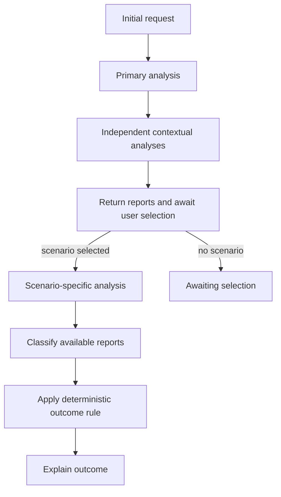

# StateGraph design — portfolio overview

This curated document shows the workflow pattern without publishing the
production state contract or strategy-specific routing rules.

## Progressive workflow

The graph carries validated state between nodes. The first stage produces the
reports that do not depend on a user-selected scenario. The second stage runs
only after the user selects a scenario and receives the preserved first-stage
reports.

## Responsibility boundaries

- Graph nodes control sequencing, continuation, parallel execution, and errors.
- Services retrieve and cache provider data.
- Tools perform deterministic calculations.
- Agents interpret validated facts and return structured model output.
- Python applies the final deterministic outcome rule.

The model does not choose the final outcome, calculate financial metrics, or
retrieve provider data directly.

## Asynchronous execution

Independent contextual reports can run concurrently after the primary report
is ready. Results are merged into shared state with explicit warnings when an
optional branch fails. The synchronous path remains a simpler reference path.

## External provider boundary

Technical data can be obtained through a direct service or an MCP HTTP provider
selected by configuration. The provider exposes a narrow validated interface;
MCP is not a replacement for the StateGraph or an uncontrolled LLM tool loop.
